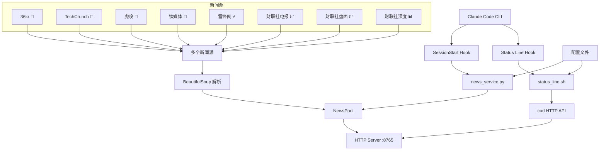
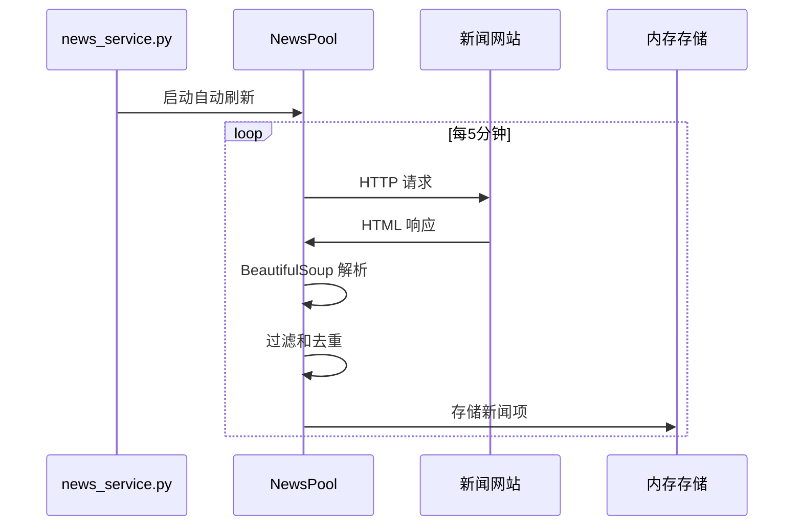
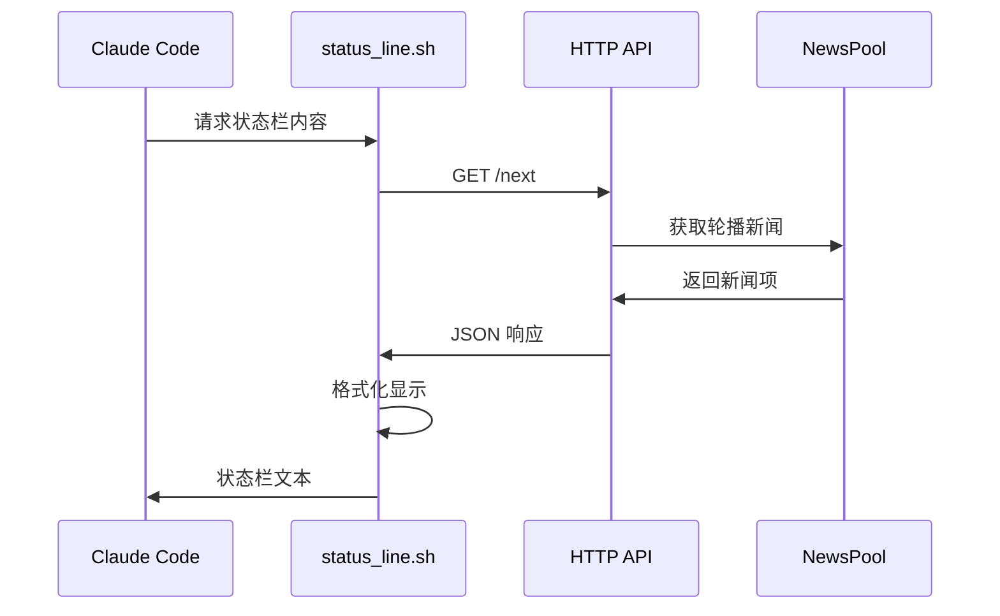

# 项目架构文档

## 📁 项目结构

```
claude-code-news-statusline/
├── 📄 README.md                    # 项目主文档
├── 📄 LICENSE                      # MIT 许可证
├── 📄 CHANGELOG.md                 # 更新日志
├── 📄 CONTRIBUTING.md              # 贡献指南
├── 📄 VERSION                      # 版本号
├── 📄 .gitignore                   # Git 忽略文件
├── 🚀 install.sh                   # 一键安装脚本
├── 🐍 news_service.py              # 核心新闻服务
├── 📜 status_line.sh               # 状态栏显示脚本
├── 📋 requirements.txt             # Python 依赖
├── 🛠️ setup.sh                     # 手动安装脚本
├── 📁 .github/                     # GitHub 配置
│   ├── 📁 workflows/
│   │   └── 📄 release.yml          # 自动发布工作流
│   └── 📁 ISSUE_TEMPLATE/
│       ├── 📄 bug_report.md        # Bug 报告模板
│       └── 📄 feature_request.md   # 功能请求模板
└── 📁 docs/                        # 文档目录
    └── 📄 ARCHITECTURE.md          # 本文档
```

## 🏗️ 系统架构



## 🔧 核心组件

### 1. 新闻服务 (news_service.py)

**职责：**
- 新闻抓取和解析
- HTTP API 服务器
- 新闻池管理
- 配置管理

**关键类：**
- `NewsItem`: 新闻项数据结构
- `NewsPool`: 新闻池管理器
- `NewsAPIHandler`: HTTP API 处理器

**API 端点：**
- `GET /status` - 服务状态
- `GET /next` - 下一条新闻
- `GET /random` - 随机新闻
- `GET /refresh` - 手动刷新

### 2. 状态栏脚本 (status_line.sh)

**职责：**
- 从 API 获取新闻
- 格式化状态栏显示
- OSC 8 超链接支持
- 图标映射

**关键功能：**
- `get_news_data()` - 获取新闻数据
- `format_news_item()` - 格式化新闻显示
- `get_source_icon()` - 图标映射

### 3. 安装脚本 (install.sh)

**职责：**
- 系统要求检查
- 自动下载和安装
- 环境配置
- Claude Code 集成

## 📊 数据流

### 新闻抓取流程



### 状态栏显示流程



## 🔧 配置系统

### 新闻源配置

位置：`~/.claude/news_sources_config.json`

```json
{
  "sources": {
    "source_key": {
      "enabled": true,
      "name": "显示名称",
      "url": "https://example.com",
      "selectors": ["CSS选择器数组"],
      "icon": "📰"
    }
  }
}
```

### Claude Code 配置

位置：`~/.claude/settings.json`

```json
{
  "hooks": {
    "SessionStart": [
      {
        "matcher": "startup|resume|clear",
        "hooks": [
          {
            "type": "command",
            "command": "绝对路径/news_service.py",
            "timeout": 30
          }
        ]
      }
    ]
  },
  "statusLine": {
    "type": "command",
    "command": "绝对路径/status_line.sh"
  }
}
```

## 🚀 性能特点

### 资源使用
- **内存占用**: ~37MB 运行时
- **启动时间**: <2秒
- **API 响应**: <100ms
- **新闻刷新**: 5分钟间隔

### 优化策略
- 新闻池限制（100条）
- 过期清理（6小时）
- 去重机制
- 错误重试

## 🔄 部署流程

### 自动部署（推荐）

```bash
curl -fsSL https://raw.githubusercontent.com/Hillyess/claude-code-news-statusline/main/install.sh | bash
```

### 手动部署

1. 环境准备
2. 文件复制
3. 依赖安装
4. 配置生成
5. 服务启动
6. 功能测试

## 📈 监控和日志

### 日志文件
- 新闻服务：`/tmp/news_service.log`
- 安装过程：`/tmp/claude_news_hook.log`

### 监控指标
- 服务运行状态
- 新闻源可用性
- API 响应时间
- 错误率统计

## 🔧 故障排除

### 常见问题
1. **端口占用**: 检查 8765 端口
2. **权限问题**: 确保脚本可执行
3. **网络问题**: 检查新闻源连接
4. **配置错误**: 验证 JSON 格式

### 调试工具
- `curl` - API 测试
- `jq` - JSON 处理
- `lsof` - 端口检查
- `ps` - 进程监控

---

此架构文档将随项目发展持续更新。